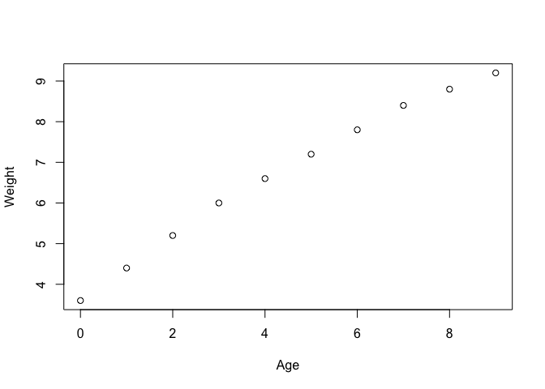
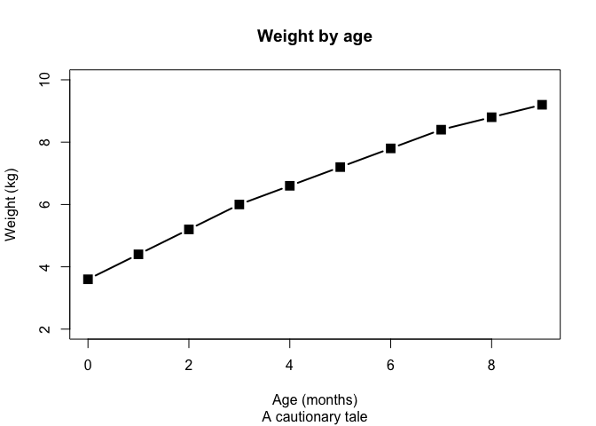
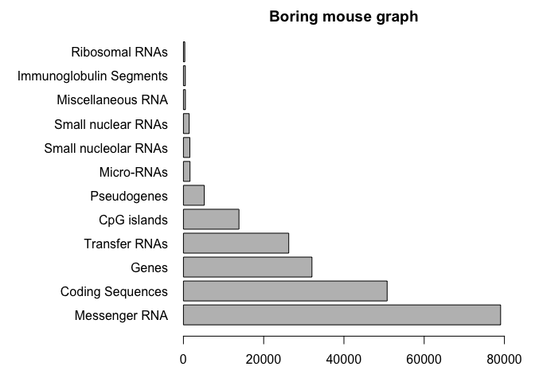
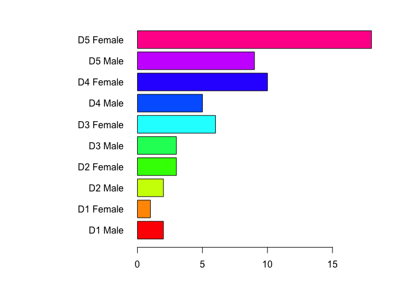
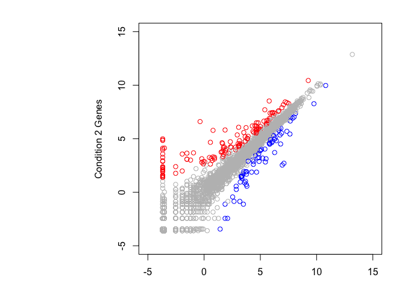

Class05
================

# Class 5 R graphics and plots

``` r
weight <- read.table("bimm143_05_rstats/weight_chart.txt", header = TRUE)
plot(weight)
```

<!-- -->

``` r
plot(weight, type = "b", main = "Weight by age", sub = "A cautionary tale", 
     xlab = "Age (months)", ylab = "Weight (kg)", ylim=c(2,10), pch = 15, cex = 1.5, lwd = 2)
```

<!-- -->

``` r
feat <- read.table("bimm143_05_rstats/feature_counts.txt", header = TRUE, sep = "\t")
par(mar = c(3, 12, 2, 2))
barplot(feat[,2], main = "Boring mouse graph", names.arg = feat[,1], cex.names = 1, horiz = TRUE, las = 1, xlim = c(0, 80000))
```

<!-- -->

``` r
counts <- read.table("bimm143_05_rstats/male_female_counts.txt", header = TRUE, sep = "\t")
rainfct <- rainbow(nrow(counts))
barplot(counts[,2], names.arg = counts[,1], col = c(rainfct), horiz = TRUE, las = 1)
```

<!-- -->

``` r
# Now onto gene expression
genes <- read.table("bimm143_05_rstats/up_down_expression.txt", header = TRUE, sep = "\t")
palette(c("blue", "gray", "red"))
plot(genes$Condition1, genes$Condition2, col = genes$State, xlab = "Condition 1 Genes", xlim = c(-5, 15), ylim = c(-5, 15), ylab = "Condition 2 Genes")
```

<!-- -->
