Class08
================

``` r
# K means clustering
# Generate some example data for clustering
tmp <- c(rnorm(30,-3), rnorm(30,3))
x <- cbind(x=tmp, y=rev(tmp))
plot(x)
```

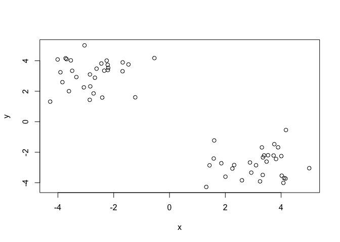

``` r
## Use the kmeans() function setting k to 2 and nstart=20 
k2 <- kmeans(x, centers=2, nstart=20)
k2
```

    ## K-means clustering with 2 clusters of sizes 30, 30
    ## 
    ## Cluster means:
    ##           x         y
    ## 1 -2.758442  3.142773
    ## 2  3.142773 -2.758442
    ## 
    ## Clustering vector:
    ##  [1] 1 1 1 1 1 1 1 1 1 1 1 1 1 1 1 1 1 1 1 1 1 1 1 1 1 1 1 1 1 1 2 2 2 2 2
    ## [36] 2 2 2 2 2 2 2 2 2 2 2 2 2 2 2 2 2 2 2 2 2 2 2 2 2
    ## 
    ## Within cluster sum of squares by cluster:
    ## [1] 50.35778 50.35778
    ##  (between_SS / total_SS =  91.2 %)
    ## 
    ## Available components:
    ## 
    ## [1] "cluster"      "centers"      "totss"        "withinss"    
    ## [5] "tot.withinss" "betweenss"    "size"         "iter"        
    ## [9] "ifault"

``` r
# How many points in each cluster?
k2$size
```

    ## [1] 30 30

``` r
table(k2$cluster)
```

    ## 
    ##  1  2 
    ## 30 30

``` r
# What is the cluster center?
k2$centers
```

    ##           x         y
    ## 1 -2.758442  3.142773
    ## 2  3.142773 -2.758442

``` r
# Plot X colored by kmeans cluster assignment
plot(x, col=k2$cluster)
points(k2$centers, col= "blue", pch = 18, cex = 3)
```

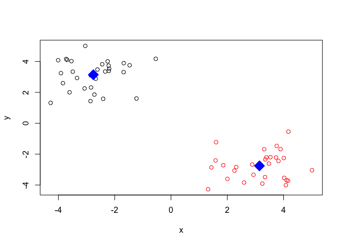

``` r
# First we need to calculate point (dis)similarity
# as the Euclidean distance between observations
dist_matrix <- dist(x)
# The hclust() function returns a hierarchical
# clustering model
hc <- hclust(d = dist_matrix)
# the print method is not so useful here
hc
```

    ## 
    ## Call:
    ## hclust(d = dist_matrix)
    ## 
    ## Cluster method   : complete 
    ## Distance         : euclidean 
    ## Number of objects: 60

``` r
plot(hc)
abline(h=6, col="red")
```

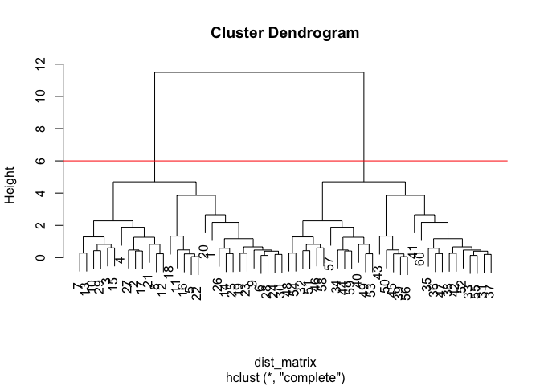

``` r
cutree(hc, h=6)
```

    ##  [1] 1 1 1 1 1 1 1 1 1 1 1 1 1 1 1 1 1 1 1 1 1 1 1 1 1 1 1 1 1 1 2 2 2 2 2
    ## [36] 2 2 2 2 2 2 2 2 2 2 2 2 2 2 2 2 2 2 2 2 2 2 2 2 2

``` r
gp2 <- cutree(hc, k=2)
gp2
```

    ##  [1] 1 1 1 1 1 1 1 1 1 1 1 1 1 1 1 1 1 1 1 1 1 1 1 1 1 1 1 1 1 1 2 2 2 2 2
    ## [36] 2 2 2 2 2 2 2 2 2 2 2 2 2 2 2 2 2 2 2 2 2 2 2 2 2

``` r
gp3 <- cutree(hc, k=3)
gp3
```

    ##  [1] 1 1 1 1 1 1 1 1 1 1 1 1 1 1 1 1 1 1 1 1 1 1 1 1 1 1 1 1 1 1 2 3 2 3 2
    ## [36] 2 2 2 2 3 2 2 2 3 2 3 2 3 3 2 3 2 3 3 2 2 3 3 3 2

``` r
table(gp3)
```

    ## gp3
    ##  1  2  3 
    ## 30 17 13

``` r
table(gp2)
```

    ## gp2
    ##  1  2 
    ## 30 30

``` r
table(gp2, gp3)
```

    ##    gp3
    ## gp2  1  2  3
    ##   1 30  0  0
    ##   2  0 17 13

``` r
x <- rbind(
 matrix(rnorm(100, mean=0, sd = 0.3), ncol = 2), # c1
 matrix(rnorm(100, mean = 1, sd = 0.3), ncol = 2), # c2
 matrix(c(rnorm(50, mean = 1, sd = 0.3), # c3
 rnorm(50, mean = 0, sd = 0.3)), ncol = 2))
colnames(x) <- c("x", "y")
# Step 2. Plot the data without clustering
plot(x)
```

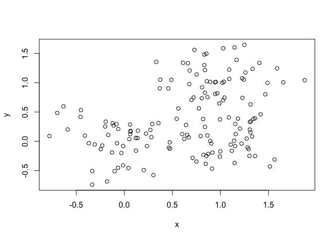

``` r
# Step 3. Generate colors for known clusters
# (just so we can compare to hclust results)
col <- as.factor( rep(c("c1","c2","c3"), each=50) )
plot(x, col=col)
```

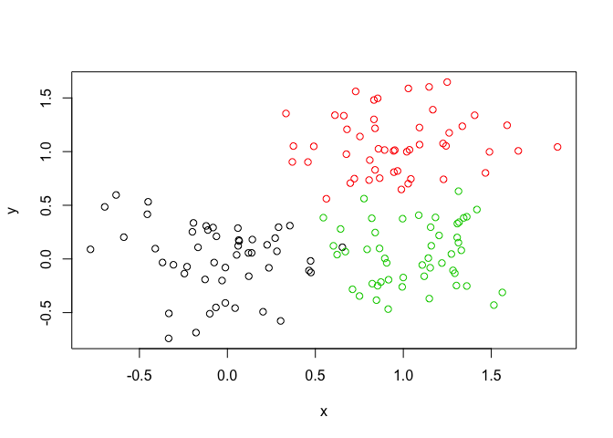

``` r
# Use the dist(), hclust(), plot() and cutree() functions to return 2 and 3 clusters. How does this compare to your known 'col' groups?
dist_matrix <- dist(x)
# The hclust() function returns a hierarchical clustering model
hc <- hclust(d = dist_matrix)
plot(hc)
```

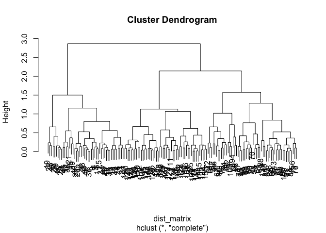

``` r
val2 <- cutree(hc, k=2)
```

``` r
val3 <- cutree(hc, k=3)
```

``` r
table(val2, val3)
```

    ##     val3
    ## val2  1  2  3
    ##    1 46  0  0
    ##    2  0 50 54

``` r
plot(hc)
abline(h=1.5, col="red")
```

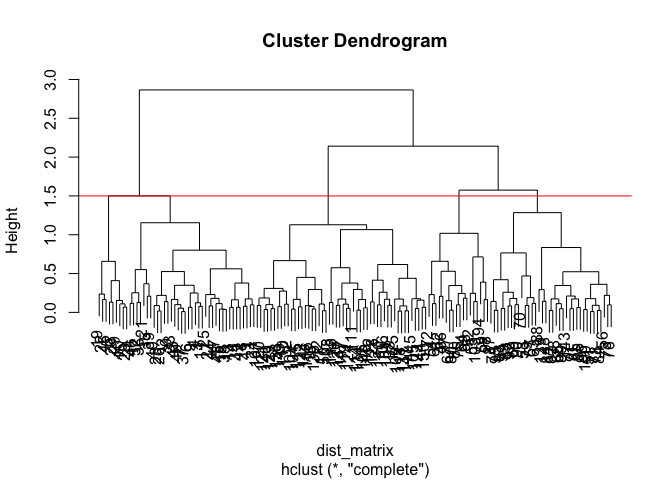

``` r
cutree(hc, h=1.5)
```

    ##   [1] 1 1 1 1 2 1 1 1 1 2 1 3 1 1 2 3 3 1 2 2 1 2 1 1 1 1 1 2 2 1 1 1 1 1 1
    ##  [36] 1 1 1 1 1 1 1 1 1 2 1 1 1 1 3 4 5 4 5 5 4 4 4 5 5 5 5 4 5 4 4 5 5 4 4
    ##  [71] 4 5 4 4 5 4 4 4 4 5 4 4 4 4 4 5 4 4 4 4 4 4 4 5 4 4 5 5 4 4 3 3 5 3 3
    ## [106] 3 3 3 3 3 3 3 3 3 3 3 3 3 3 3 3 3 3 3 3 3 3 3 3 3 3 3 3 3 3 3 3 3 4 3
    ## [141] 3 3 4 3 3 3 3 4 3 3

``` r
plot(x, col=val2)
```

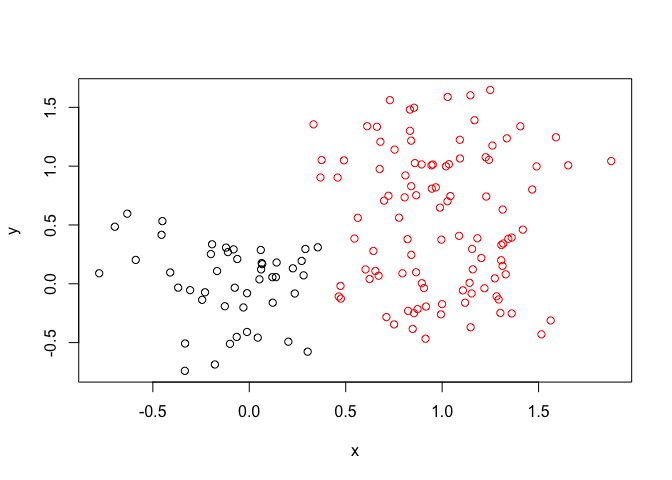

``` r
plot(x, col=val3)
```

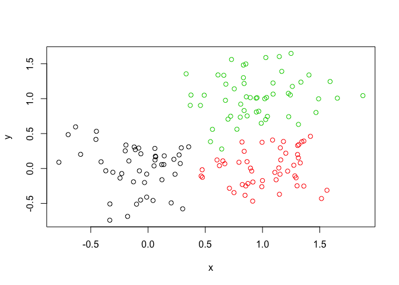

Moving on to Principal Component Analysis:

``` r
mydata <- read.csv("https://tinyurl.com/expression-CSV", row.names = 1)
```

There are 100 genes in this dataset Let's run PCA

``` r
pca <- prcomp(t(mydata), scale=TRUE)
summary(pca)
```

    ## Importance of components:
    ##                           PC1    PC2     PC3     PC4     PC5     PC6
    ## Standard deviation     9.6237 1.5198 1.05787 1.05203 0.88062 0.82545
    ## Proportion of Variance 0.9262 0.0231 0.01119 0.01107 0.00775 0.00681
    ## Cumulative Proportion  0.9262 0.9493 0.96045 0.97152 0.97928 0.98609
    ##                            PC7     PC8     PC9      PC10
    ## Standard deviation     0.80111 0.62065 0.60342 3.348e-15
    ## Proportion of Variance 0.00642 0.00385 0.00364 0.000e+00
    ## Cumulative Proportion  0.99251 0.99636 1.00000 1.000e+00

``` r
attributes(pca)
```

    ## $names
    ## [1] "sdev"     "rotation" "center"   "scale"    "x"       
    ## 
    ## $class
    ## [1] "prcomp"

The first PCA plot

``` r
plot(x = pca$x[,1], y = pca$x[,2])
```

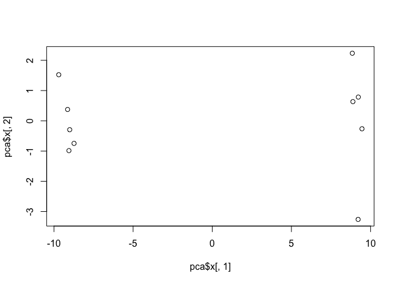 Let's get our scree plot

``` r
pca.var <- pca$sdev^2
pca.var.per <- round(pca.var/sum(pca.var)*100, 1)
barplot(pca.var.per)
```

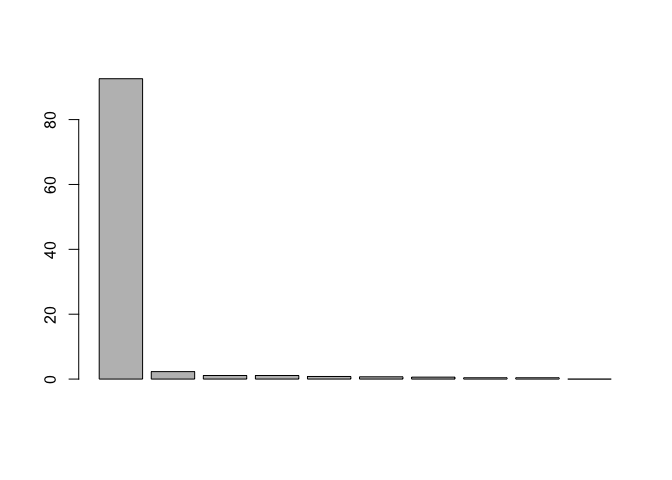

``` r
mycols <- c(rep("red", 5), rep("blue", 5))
```

A nicer PCA plot

``` r
plot(x = pca$x[,1], y = pca$x[,2], xlab = paste("PC1 (",pca.var.per[1], "%)"), ylab = paste("PC2 (", pca.var.per[2], "%)"), col = mycols)
text(pca$x[,1], y = pca$x[,2], colnames(mydata))
```

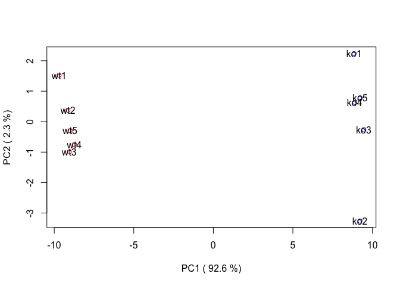

``` r
x <- read.csv("UK_foods.csv", row.names = 1)
dim(x)
```

    ## [1] 17  4

``` r
nrow(x)
```

    ## [1] 17

``` r
ncol(x)
```

    ## [1] 4

``` r
x
```

    ##                     England Wales Scotland N.Ireland
    ## Cheese                  105   103      103        66
    ## Carcass_meat            245   227      242       267
    ## Other_meat              685   803      750       586
    ## Fish                    147   160      122        93
    ## Fats_and_oils           193   235      184       209
    ## Sugars                  156   175      147       139
    ## Fresh_potatoes          720   874      566      1033
    ## Fresh_Veg               253   265      171       143
    ## Other_Veg               488   570      418       355
    ## Processed_potatoes      198   203      220       187
    ## Processed_Veg           360   365      337       334
    ## Fresh_fruit            1102  1137      957       674
    ## Cereals                1472  1582     1462      1494
    ## Beverages                57    73       53        47
    ## Soft_drinks            1374  1256     1572      1506
    ## Alcoholic_drinks        375   475      458       135
    ## Confectionery            54    64       62        41

``` r
barplotx <- barplot(as.matrix(x), beside=F, col=rainbow(nrow(x)))
```

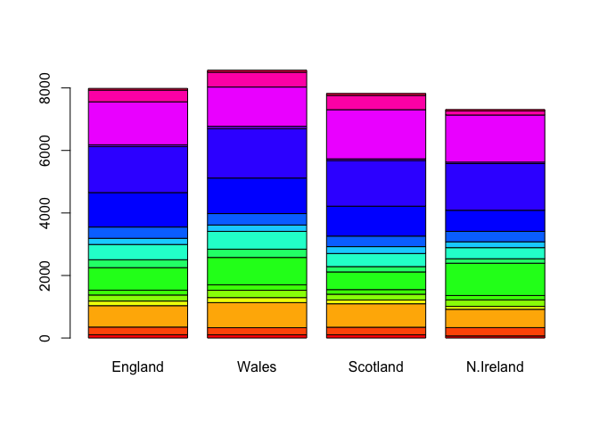

``` r
barplotx
```

    ## [1] 0.7 1.9 3.1 4.3

``` r
pairanalysis <- pairs(x, col=rainbow(10), pch=16)
```

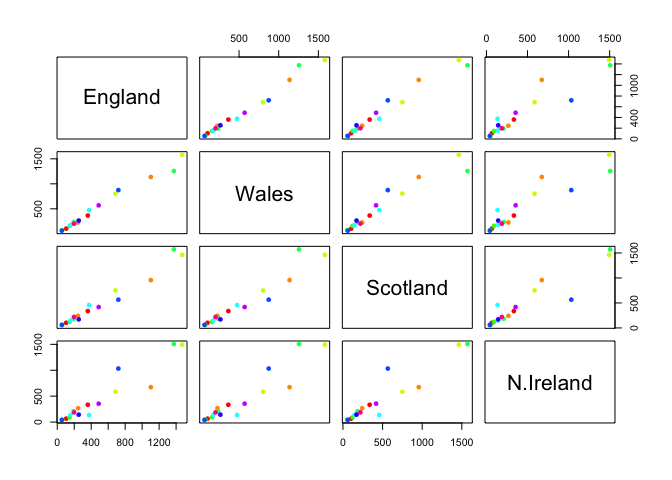

``` r
pairanalysis
```

    ## NULL

``` r
pca <- prcomp(t(x))
summary(pca)
```

    ## Importance of components:
    ##                             PC1      PC2      PC3       PC4
    ## Standard deviation     324.1502 212.7478 73.87622 4.189e-14
    ## Proportion of Variance   0.6744   0.2905  0.03503 0.000e+00
    ## Cumulative Proportion    0.6744   0.9650  1.00000 1.000e+00

``` r
# Plot PC1 vs PC2
mycols <- c("orange", "red", "blue", "green")
plot(pca$x[,1], pca$x[,2], xlab="PC1", ylab="PC2", xlim=c(-270,500))
text(pca$x[,1], pca$x[,2], colnames(x), col = mycols)
```

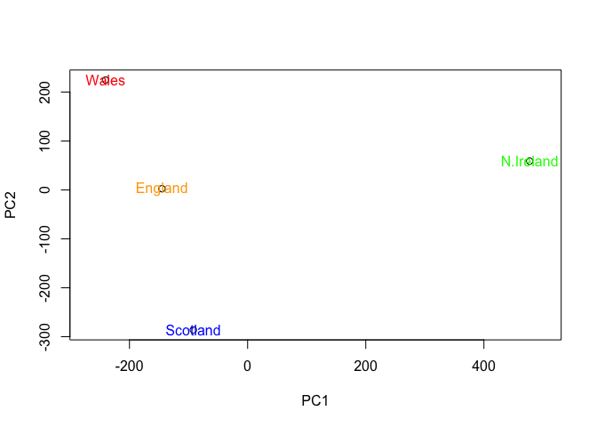 Scree Plot

``` r
pca.var2 <- round((pca$sdev^2)/sum(pca$sdev^2) * 100)
pca.var2
```

    ## [1] 67 29  4  0

``` r
barplot(pca.var2, xlab = "Principal Component", ylab = "Percent Variation")
```

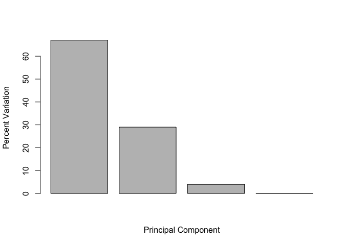

``` r
## Lets focus on PC1 as it accounts for > 90% of variance 
par(mar=c(10, 3, 0.35, 0))
barplot(pca$rotation[,1], las=2)
```

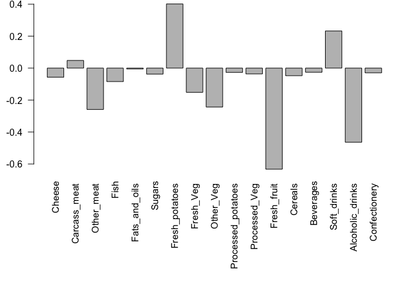

``` r
## Lets focus on PC1 as it accounts for > 90% of variance 
par(mar=c(10, 3, 0.35, 0))
barplot(pca$rotation[,2], las=2)
```

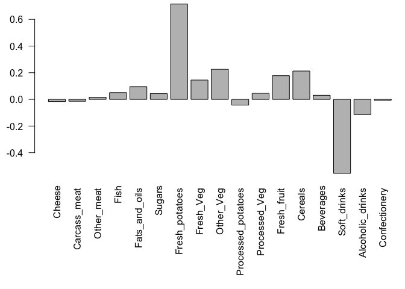
