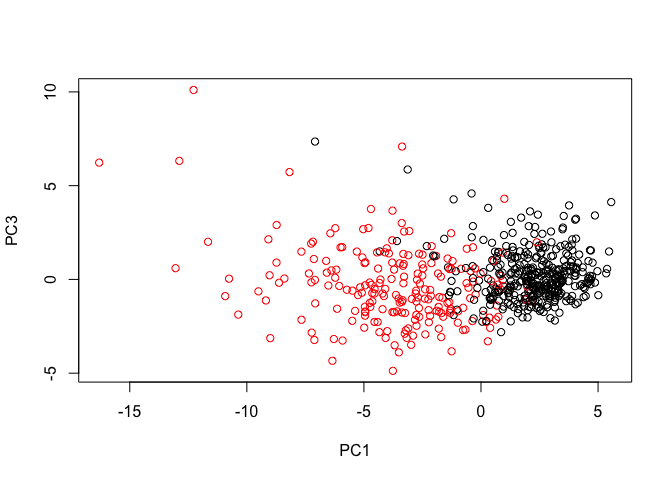

Class09
================

``` r
# Open our data
wisc.df <- read.csv("WisconsinCancer.csv", row.names = 1)
# How many patients?
nrow(wisc.df)
```

    ## [1] 569

``` r
# How many malignant?
print(table(wisc.df$diagnosis))
```

    ## 
    ##   B   M 
    ## 357 212

``` r
# How many columns have "mean" in them?
length(grep("mean", colnames(wisc.df)))
```

    ## [1] 10

``` r
# Turn most of the colums into a data frame
wisc.data <- as.matrix(wisc.df[,2:31])
# Save the diagnosis column for later
diagnosis <- wisc.df[,1]
```

``` r
# Do we scale? Check by looking at the means and SDs
round(colMeans(wisc.data))
```

    ##             radius_mean            texture_mean          perimeter_mean 
    ##                      14                      19                      92 
    ##               area_mean         smoothness_mean        compactness_mean 
    ##                     655                       0                       0 
    ##          concavity_mean     concave.points_mean           symmetry_mean 
    ##                       0                       0                       0 
    ##  fractal_dimension_mean               radius_se              texture_se 
    ##                       0                       0                       1 
    ##            perimeter_se                 area_se           smoothness_se 
    ##                       3                      40                       0 
    ##          compactness_se            concavity_se       concave.points_se 
    ##                       0                       0                       0 
    ##             symmetry_se    fractal_dimension_se            radius_worst 
    ##                       0                       0                      16 
    ##           texture_worst         perimeter_worst              area_worst 
    ##                      26                     107                     881 
    ##        smoothness_worst       compactness_worst         concavity_worst 
    ##                       0                       0                       0 
    ##    concave.points_worst          symmetry_worst fractal_dimension_worst 
    ##                       0                       0                       0

``` r
round(apply(wisc.data,2,sd))
```

    ##             radius_mean            texture_mean          perimeter_mean 
    ##                       4                       4                      24 
    ##               area_mean         smoothness_mean        compactness_mean 
    ##                     352                       0                       0 
    ##          concavity_mean     concave.points_mean           symmetry_mean 
    ##                       0                       0                       0 
    ##  fractal_dimension_mean               radius_se              texture_se 
    ##                       0                       0                       1 
    ##            perimeter_se                 area_se           smoothness_se 
    ##                       2                      45                       0 
    ##          compactness_se            concavity_se       concave.points_se 
    ##                       0                       0                       0 
    ##             symmetry_se    fractal_dimension_se            radius_worst 
    ##                       0                       0                       5 
    ##           texture_worst         perimeter_worst              area_worst 
    ##                       6                      34                     569 
    ##        smoothness_worst       compactness_worst         concavity_worst 
    ##                       0                       0                       0 
    ##    concave.points_worst          symmetry_worst fractal_dimension_worst 
    ##                       0                       0                       0

``` r
wisc.pr <- prcomp(wisc.data, scale = TRUE)
summary(wisc.pr)
```

    ## Importance of components:
    ##                           PC1    PC2     PC3     PC4     PC5     PC6
    ## Standard deviation     3.6444 2.3857 1.67867 1.40735 1.28403 1.09880
    ## Proportion of Variance 0.4427 0.1897 0.09393 0.06602 0.05496 0.04025
    ## Cumulative Proportion  0.4427 0.6324 0.72636 0.79239 0.84734 0.88759
    ##                            PC7     PC8    PC9    PC10   PC11    PC12
    ## Standard deviation     0.82172 0.69037 0.6457 0.59219 0.5421 0.51104
    ## Proportion of Variance 0.02251 0.01589 0.0139 0.01169 0.0098 0.00871
    ## Cumulative Proportion  0.91010 0.92598 0.9399 0.95157 0.9614 0.97007
    ##                           PC13    PC14    PC15    PC16    PC17    PC18
    ## Standard deviation     0.49128 0.39624 0.30681 0.28260 0.24372 0.22939
    ## Proportion of Variance 0.00805 0.00523 0.00314 0.00266 0.00198 0.00175
    ## Cumulative Proportion  0.97812 0.98335 0.98649 0.98915 0.99113 0.99288
    ##                           PC19    PC20   PC21    PC22    PC23   PC24
    ## Standard deviation     0.22244 0.17652 0.1731 0.16565 0.15602 0.1344
    ## Proportion of Variance 0.00165 0.00104 0.0010 0.00091 0.00081 0.0006
    ## Cumulative Proportion  0.99453 0.99557 0.9966 0.99749 0.99830 0.9989
    ##                           PC25    PC26    PC27    PC28    PC29    PC30
    ## Standard deviation     0.12442 0.09043 0.08307 0.03987 0.02736 0.01153
    ## Proportion of Variance 0.00052 0.00027 0.00023 0.00005 0.00002 0.00000
    ## Cumulative Proportion  0.99942 0.99969 0.99992 0.99997 1.00000 1.00000

``` r
# Plot the data
# biplot(wisc.pr)
# Plot PC1 and PC2
plot(wisc.pr$x[,1:2], col = diagnosis, xlab = "PC1", ylab = "PC2")
```

<!-- -->

``` r
# Plot PC1 and PC3
plot(wisc.pr$x[,1], wisc.pr$x[,3], col = diagnosis, xlab = "PC1", ylab = "PC3")
```

<!-- -->

``` r
# What is the variance captured by each PC?
pr.var <- (wisc.pr$sdev^2)
head(pr.var)
```

    ## [1] 13.281608  5.691355  2.817949  1.980640  1.648731  1.207357

``` r
sum(pr.var)
```

    ## [1] 30

``` r
pve <- pr.var / sum(pr.var)
# We can make a line plot
# plot(pve, xlab = "Principal Component", ylab = "Proportion of Variance Explained", ylim = c(0,1), type = "o")
# Or we can make a bar plot
barplot(pve, ylab = "Percent of Variance Explained", names.arg = paste0("PC", 1:length(pve)), las = 2, axes = FALSE)
axis(2, at = pve, labels = round(pve,2)*100)
```

<!-- -->

``` r
## ggplot based graph
#install.packages("factoextra")
library(factoextra)
```

    ## Loading required package: ggplot2

    ## Registered S3 methods overwritten by 'ggplot2':
    ##   method         from 
    ##   [.quosures     rlang
    ##   c.quosures     rlang
    ##   print.quosures rlang

    ## Welcome! Related Books: `Practical Guide To Cluster Analysis in R` at https://goo.gl/13EFCZ

``` r
fviz_eig(wisc.pr, addlabels = TRUE)
```

<!-- -->

``` r
wisc.pr$rotation["radius_mean",1]
```

    ## [1] -0.2189024

``` r
wisc.pr$rotation["smoothness_se",1]
```

    ## [1] -0.01453145

``` r
sort(abs(wisc.pr$rotation[,1]))
```

    ##           smoothness_se              texture_se             symmetry_se 
    ##              0.01453145              0.01742803              0.04249842 
    ##  fractal_dimension_mean    fractal_dimension_se            texture_mean 
    ##              0.06436335              0.10256832              0.10372458 
    ##           texture_worst          symmetry_worst        smoothness_worst 
    ##              0.10446933              0.12290456              0.12795256 
    ## fractal_dimension_worst           symmetry_mean         smoothness_mean 
    ##              0.13178394              0.13816696              0.14258969 
    ##            concavity_se          compactness_se       concave.points_se 
    ##              0.15358979              0.17039345              0.18341740 
    ##                 area_se               radius_se       compactness_worst 
    ##              0.20286964              0.20597878              0.21009588 
    ##            perimeter_se             radius_mean               area_mean 
    ##              0.21132592              0.21890244              0.22099499 
    ##              area_worst          perimeter_mean            radius_worst 
    ##              0.22487053              0.22753729              0.22799663 
    ##         concavity_worst         perimeter_worst        compactness_mean 
    ##              0.22876753              0.23663968              0.23928535 
    ##    concave.points_worst          concavity_mean     concave.points_mean 
    ##              0.25088597              0.25840048              0.26085376

``` r
# View(wisc.pr$rotation)
```

``` r
data.scaled <- scale(wisc.data)
data.dist <- dist(data.scaled)
hclust1 <- hclust(data.dist, method = 'complete')
plot(hclust1)
```

<!-- -->

``` r
cut_avg <- cutree(hclust1, k = 4)
# last argument can be h and then that tells it the height
table(cut_avg, diagnosis)
```

    ##        diagnosis
    ## cut_avg   B   M
    ##       1  12 165
    ##       2   2   5
    ##       3 343  40
    ##       4   0   2

# Section 5

# Use PCA to potentially help the hierarchical clustering

# Start with the PCs that capture 90% of the variance

``` r
wisc.pr.hclust <- hclust( dist( wisc.pr$x[,1:7]), method = "ward.D2" )
plot(wisc.pr.hclust)
abline(h=70, col = "red", lty = 2)
```

<!-- -->

``` r
grps <- cutree(wisc.pr.hclust, k = 2)
table(grps)
```

    ## grps
    ##   1   2 
    ## 216 353

``` r
table(grps, diagnosis)
```

    ##     diagnosis
    ## grps   B   M
    ##    1  28 188
    ##    2 329  24

``` r
plot(wisc.pr$x[,1], wisc.pr$x[,2], col = grps)
```

<!-- -->

``` r
url <- "https://tinyurl.com/new-samples-CSV"
new <- read.csv(url)
npc <- predict(wisc.pr, newdata=new)
npc
```

    ##            PC1       PC2        PC3        PC4       PC5        PC6
    ## [1,]  2.576616 -3.135913  1.3990492 -0.7631950  2.781648 -0.8150185
    ## [2,] -4.754928 -3.009033 -0.1660946 -0.6052952 -1.140698 -1.2189945
    ##             PC7        PC8       PC9       PC10      PC11      PC12
    ## [1,] -0.3959098 -0.2307350 0.1029569 -0.9272861 0.3411457  0.375921
    ## [2,]  0.8193031 -0.3307423 0.5281896 -0.4855301 0.7173233 -1.185917
    ##           PC13     PC14      PC15       PC16        PC17        PC18
    ## [1,] 0.1610764 1.187882 0.3216974 -0.1743616 -0.07875393 -0.11207028
    ## [2,] 0.5893856 0.303029 0.1299153  0.1448061 -0.40509706  0.06565549
    ##             PC19       PC20       PC21       PC22       PC23       PC24
    ## [1,] -0.08802955 -0.2495216  0.1228233 0.09358453 0.08347651  0.1223396
    ## [2,]  0.25591230 -0.4289500 -0.1224776 0.01732146 0.06316631 -0.2338618
    ##             PC25         PC26         PC27        PC28         PC29
    ## [1,]  0.02124121  0.078884581  0.220199544 -0.02946023 -0.015620933
    ## [2,] -0.20755948 -0.009833238 -0.001134152  0.09638361  0.002795349
    ##              PC30
    ## [1,]  0.005269029
    ## [2,] -0.019015820

``` r
plot(wisc.pr$x[,1:2], col= diagnosis)
points(npc[,1], npc[,2], col="blue", pch=16, cex=3)
text(npc[,1], npc[,2], c(1,2), col="white")
```

<!-- -->
