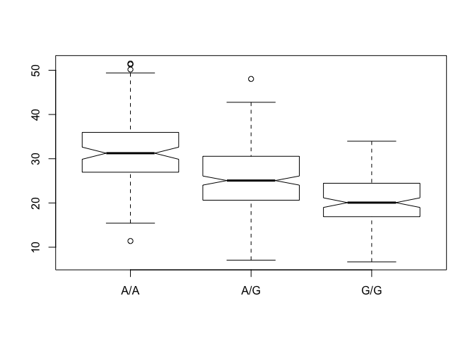

Class13
================

``` r
Mex <- read.csv("373531-SampleGenotypes-Homo_sapiens_Variation_Sample_rs8067378.csv")
table(Mex$Genotype..forward.strand.)
```

    ## 
    ## A|A A|G G|A G|G 
    ##  22  21  12   9

``` r
# proportion
round((table(Mex$Genotype..forward.strand.)/nrow(Mex)) * 100, 2)
```

    ## 
    ##   A|A   A|G   G|A   G|G 
    ## 34.38 32.81 18.75 14.06

``` r
cl13 <- read.csv(url("https://bioboot.github.io/bggn213_W19/class-material/rs8067378_ENSG00000172057.6.txt"), sep = " ")
summary(cl13)
```

    ##      sample     geno          exp        
    ##  HG00096:  1   A/A:108   Min.   : 6.675  
    ##  HG00097:  1   A/G:233   1st Qu.:20.004  
    ##  HG00099:  1   G/G:121   Median :25.116  
    ##  HG00100:  1             Mean   :25.640  
    ##  HG00101:  1             3rd Qu.:30.779  
    ##  HG00102:  1             Max.   :51.518  
    ##  (Other):456

``` r
# Box plot for A/A genotype
# table(cl13$geno)
cl13$geno == "A/A"
```

    ##   [1] FALSE FALSE  TRUE  TRUE FALSE  TRUE FALSE  TRUE FALSE FALSE FALSE
    ##  [12] FALSE  TRUE FALSE  TRUE  TRUE FALSE  TRUE FALSE FALSE FALSE FALSE
    ##  [23] FALSE  TRUE FALSE FALSE  TRUE FALSE FALSE  TRUE FALSE FALSE FALSE
    ##  [34] FALSE FALSE FALSE  TRUE FALSE FALSE FALSE FALSE FALSE FALSE FALSE
    ##  [45] FALSE FALSE FALSE  TRUE FALSE FALSE FALSE FALSE  TRUE FALSE  TRUE
    ##  [56] FALSE FALSE FALSE FALSE FALSE FALSE  TRUE FALSE FALSE FALSE FALSE
    ##  [67]  TRUE FALSE FALSE FALSE FALSE FALSE FALSE FALSE FALSE  TRUE FALSE
    ##  [78] FALSE FALSE FALSE FALSE  TRUE FALSE FALSE FALSE FALSE FALSE FALSE
    ##  [89] FALSE FALSE FALSE FALSE FALSE FALSE FALSE  TRUE  TRUE FALSE  TRUE
    ## [100] FALSE FALSE  TRUE FALSE FALSE FALSE FALSE FALSE FALSE FALSE FALSE
    ## [111] FALSE  TRUE FALSE FALSE FALSE FALSE FALSE FALSE FALSE FALSE  TRUE
    ## [122]  TRUE FALSE FALSE FALSE FALSE  TRUE FALSE FALSE FALSE FALSE FALSE
    ## [133]  TRUE FALSE FALSE FALSE FALSE FALSE FALSE FALSE FALSE FALSE FALSE
    ## [144] FALSE FALSE FALSE FALSE FALSE FALSE FALSE FALSE FALSE FALSE  TRUE
    ## [155]  TRUE FALSE FALSE FALSE FALSE FALSE FALSE  TRUE FALSE FALSE FALSE
    ## [166] FALSE  TRUE FALSE  TRUE FALSE FALSE FALSE FALSE  TRUE FALSE FALSE
    ## [177]  TRUE FALSE  TRUE  TRUE FALSE  TRUE FALSE FALSE FALSE FALSE  TRUE
    ## [188]  TRUE FALSE FALSE FALSE FALSE FALSE FALSE FALSE FALSE FALSE  TRUE
    ## [199] FALSE FALSE FALSE  TRUE FALSE FALSE  TRUE FALSE FALSE FALSE FALSE
    ## [210] FALSE FALSE FALSE FALSE  TRUE  TRUE FALSE  TRUE FALSE FALSE FALSE
    ## [221] FALSE FALSE FALSE FALSE FALSE  TRUE  TRUE  TRUE  TRUE  TRUE FALSE
    ## [232] FALSE FALSE FALSE  TRUE FALSE FALSE FALSE FALSE  TRUE FALSE  TRUE
    ## [243]  TRUE FALSE  TRUE  TRUE FALSE  TRUE FALSE FALSE FALSE FALSE FALSE
    ## [254] FALSE FALSE FALSE  TRUE FALSE FALSE FALSE FALSE FALSE  TRUE  TRUE
    ## [265]  TRUE  TRUE FALSE FALSE  TRUE  TRUE FALSE FALSE FALSE FALSE  TRUE
    ## [276] FALSE FALSE  TRUE FALSE FALSE FALSE FALSE FALSE FALSE FALSE FALSE
    ## [287] FALSE FALSE FALSE  TRUE FALSE FALSE FALSE FALSE FALSE FALSE FALSE
    ## [298]  TRUE FALSE FALSE FALSE FALSE FALSE  TRUE  TRUE  TRUE FALSE FALSE
    ## [309] FALSE FALSE FALSE FALSE FALSE FALSE FALSE FALSE FALSE FALSE FALSE
    ## [320] FALSE FALSE  TRUE FALSE FALSE FALSE FALSE FALSE FALSE FALSE FALSE
    ## [331] FALSE  TRUE FALSE FALSE FALSE FALSE  TRUE FALSE FALSE FALSE  TRUE
    ## [342] FALSE  TRUE FALSE FALSE  TRUE FALSE  TRUE FALSE FALSE FALSE FALSE
    ## [353] FALSE  TRUE FALSE FALSE FALSE FALSE  TRUE  TRUE FALSE FALSE FALSE
    ## [364] FALSE FALSE FALSE FALSE  TRUE FALSE  TRUE  TRUE FALSE FALSE  TRUE
    ## [375] FALSE FALSE FALSE FALSE FALSE FALSE FALSE  TRUE FALSE  TRUE FALSE
    ## [386]  TRUE FALSE FALSE  TRUE  TRUE FALSE FALSE FALSE FALSE FALSE FALSE
    ## [397] FALSE FALSE FALSE  TRUE  TRUE FALSE FALSE FALSE  TRUE FALSE FALSE
    ## [408]  TRUE  TRUE FALSE FALSE  TRUE FALSE FALSE FALSE FALSE FALSE FALSE
    ## [419] FALSE  TRUE FALSE FALSE FALSE  TRUE FALSE  TRUE FALSE FALSE FALSE
    ## [430] FALSE FALSE FALSE  TRUE FALSE FALSE FALSE FALSE FALSE FALSE FALSE
    ## [441] FALSE  TRUE  TRUE FALSE FALSE FALSE FALSE  TRUE FALSE FALSE  TRUE
    ## [452] FALSE FALSE FALSE FALSE  TRUE FALSE FALSE  TRUE FALSE  TRUE FALSE

``` r
AA <- cl13[cl13$geno == "A/A", ]
summary(AA)
```

    ##      sample     geno          exp       
    ##  HG00096:  1   A/A:108   Min.   :11.40  
    ##  HG00100:  1   A/G:  0   1st Qu.:27.02  
    ##  HG00101:  1   G/G:  0   Median :31.25  
    ##  HG00102:  1             Mean   :31.82  
    ##  HG00104:  1             3rd Qu.:35.92  
    ##  HG00105:  1             Max.   :51.52  
    ##  (Other):102

``` r
# Box plot for G/G genotype
# table(cl13$geno)
cl13$geno == "G/G"
```

    ##   [1] FALSE FALSE FALSE FALSE  TRUE FALSE FALSE FALSE  TRUE FALSE FALSE
    ##  [12] FALSE FALSE FALSE FALSE FALSE  TRUE FALSE FALSE  TRUE FALSE FALSE
    ##  [23]  TRUE FALSE FALSE FALSE FALSE  TRUE  TRUE FALSE  TRUE  TRUE FALSE
    ##  [34] FALSE  TRUE FALSE FALSE FALSE FALSE FALSE  TRUE FALSE FALSE FALSE
    ##  [45] FALSE  TRUE  TRUE FALSE  TRUE  TRUE FALSE FALSE FALSE FALSE FALSE
    ##  [56]  TRUE  TRUE FALSE FALSE FALSE  TRUE FALSE FALSE FALSE FALSE FALSE
    ##  [67] FALSE FALSE FALSE FALSE FALSE  TRUE  TRUE FALSE FALSE FALSE  TRUE
    ##  [78] FALSE  TRUE FALSE FALSE FALSE FALSE FALSE  TRUE FALSE FALSE FALSE
    ##  [89]  TRUE FALSE FALSE  TRUE  TRUE FALSE FALSE FALSE FALSE FALSE FALSE
    ## [100] FALSE FALSE FALSE FALSE  TRUE  TRUE  TRUE FALSE FALSE  TRUE  TRUE
    ## [111]  TRUE FALSE FALSE  TRUE  TRUE FALSE  TRUE  TRUE  TRUE FALSE FALSE
    ## [122] FALSE FALSE FALSE FALSE FALSE FALSE  TRUE FALSE FALSE FALSE  TRUE
    ## [133] FALSE FALSE  TRUE FALSE FALSE FALSE FALSE  TRUE FALSE FALSE  TRUE
    ## [144] FALSE FALSE FALSE FALSE FALSE FALSE  TRUE FALSE FALSE  TRUE FALSE
    ## [155] FALSE  TRUE FALSE FALSE  TRUE FALSE FALSE FALSE  TRUE FALSE FALSE
    ## [166]  TRUE FALSE FALSE FALSE  TRUE  TRUE  TRUE FALSE FALSE  TRUE FALSE
    ## [177] FALSE  TRUE FALSE FALSE FALSE FALSE FALSE FALSE FALSE FALSE FALSE
    ## [188] FALSE FALSE  TRUE FALSE FALSE  TRUE  TRUE  TRUE FALSE FALSE FALSE
    ## [199]  TRUE FALSE  TRUE FALSE FALSE FALSE FALSE FALSE  TRUE FALSE FALSE
    ## [210] FALSE  TRUE FALSE FALSE FALSE FALSE FALSE FALSE  TRUE FALSE FALSE
    ## [221] FALSE FALSE FALSE  TRUE  TRUE FALSE FALSE FALSE FALSE FALSE FALSE
    ## [232]  TRUE  TRUE FALSE FALSE FALSE FALSE FALSE  TRUE FALSE  TRUE FALSE
    ## [243] FALSE FALSE FALSE FALSE  TRUE FALSE FALSE  TRUE FALSE FALSE  TRUE
    ## [254]  TRUE FALSE FALSE FALSE FALSE  TRUE FALSE  TRUE FALSE FALSE FALSE
    ## [265] FALSE FALSE  TRUE  TRUE FALSE FALSE  TRUE  TRUE FALSE FALSE FALSE
    ## [276] FALSE FALSE FALSE FALSE  TRUE FALSE FALSE  TRUE FALSE  TRUE FALSE
    ## [287]  TRUE  TRUE FALSE FALSE FALSE  TRUE  TRUE FALSE FALSE FALSE FALSE
    ## [298] FALSE  TRUE FALSE FALSE FALSE FALSE FALSE FALSE FALSE  TRUE  TRUE
    ## [309] FALSE FALSE FALSE FALSE FALSE  TRUE FALSE  TRUE FALSE FALSE  TRUE
    ## [320] FALSE FALSE FALSE FALSE FALSE FALSE FALSE FALSE FALSE FALSE  TRUE
    ## [331] FALSE FALSE FALSE FALSE FALSE FALSE FALSE FALSE FALSE  TRUE FALSE
    ## [342] FALSE FALSE  TRUE FALSE FALSE FALSE FALSE FALSE FALSE  TRUE FALSE
    ## [353] FALSE FALSE  TRUE  TRUE  TRUE FALSE FALSE FALSE  TRUE  TRUE FALSE
    ## [364]  TRUE FALSE FALSE FALSE FALSE  TRUE FALSE FALSE FALSE  TRUE FALSE
    ## [375]  TRUE  TRUE FALSE  TRUE  TRUE  TRUE  TRUE FALSE  TRUE FALSE  TRUE
    ## [386] FALSE FALSE FALSE FALSE FALSE  TRUE FALSE  TRUE FALSE FALSE FALSE
    ## [397] FALSE FALSE FALSE FALSE FALSE FALSE FALSE FALSE FALSE FALSE FALSE
    ## [408] FALSE FALSE FALSE FALSE FALSE FALSE FALSE FALSE FALSE FALSE FALSE
    ## [419] FALSE FALSE  TRUE FALSE FALSE FALSE FALSE FALSE FALSE  TRUE FALSE
    ## [430] FALSE FALSE FALSE FALSE FALSE  TRUE  TRUE FALSE FALSE FALSE FALSE
    ## [441] FALSE FALSE FALSE FALSE FALSE  TRUE FALSE FALSE FALSE FALSE FALSE
    ## [452] FALSE FALSE  TRUE FALSE FALSE  TRUE  TRUE FALSE FALSE FALSE FALSE

``` r
GG <- cl13[cl13$geno == "G/G", ]
summary(GG)
```

    ##      sample     geno          exp        
    ##  HG00099:  1   A/A:  0   Min.   : 6.675  
    ##  HG00109:  1   A/G:  0   1st Qu.:16.903  
    ##  HG00112:  1   G/G:121   Median :20.074  
    ##  HG00116:  1             Mean   :20.594  
    ##  HG00118:  1             3rd Qu.:24.457  
    ##  HG00120:  1             Max.   :33.956  
    ##  (Other):115

``` r
# Box plot for A/G genotype
# table(cl13$geno)
cl13$geno == "A/G"
```

    ##   [1]  TRUE  TRUE FALSE FALSE FALSE FALSE  TRUE FALSE FALSE  TRUE  TRUE
    ##  [12]  TRUE FALSE  TRUE FALSE FALSE FALSE FALSE  TRUE FALSE  TRUE  TRUE
    ##  [23] FALSE FALSE  TRUE  TRUE FALSE FALSE FALSE FALSE FALSE FALSE  TRUE
    ##  [34]  TRUE FALSE  TRUE FALSE  TRUE  TRUE  TRUE FALSE  TRUE  TRUE  TRUE
    ##  [45]  TRUE FALSE FALSE FALSE FALSE FALSE  TRUE  TRUE FALSE  TRUE FALSE
    ##  [56] FALSE FALSE  TRUE  TRUE  TRUE FALSE FALSE  TRUE  TRUE  TRUE  TRUE
    ##  [67] FALSE  TRUE  TRUE  TRUE  TRUE FALSE FALSE  TRUE  TRUE FALSE FALSE
    ##  [78]  TRUE FALSE  TRUE  TRUE FALSE  TRUE  TRUE FALSE  TRUE  TRUE  TRUE
    ##  [89] FALSE  TRUE  TRUE FALSE FALSE  TRUE  TRUE FALSE FALSE  TRUE FALSE
    ## [100]  TRUE  TRUE FALSE  TRUE FALSE FALSE FALSE  TRUE  TRUE FALSE FALSE
    ## [111] FALSE FALSE  TRUE FALSE FALSE  TRUE FALSE FALSE FALSE  TRUE FALSE
    ## [122] FALSE  TRUE  TRUE  TRUE  TRUE FALSE FALSE  TRUE  TRUE  TRUE FALSE
    ## [133] FALSE  TRUE FALSE  TRUE  TRUE  TRUE  TRUE FALSE  TRUE  TRUE FALSE
    ## [144]  TRUE  TRUE  TRUE  TRUE  TRUE  TRUE FALSE  TRUE  TRUE FALSE FALSE
    ## [155] FALSE FALSE  TRUE  TRUE FALSE  TRUE  TRUE FALSE FALSE  TRUE  TRUE
    ## [166] FALSE FALSE  TRUE FALSE FALSE FALSE FALSE  TRUE FALSE FALSE  TRUE
    ## [177] FALSE FALSE FALSE FALSE  TRUE FALSE  TRUE  TRUE  TRUE  TRUE FALSE
    ## [188] FALSE  TRUE FALSE  TRUE  TRUE FALSE FALSE FALSE  TRUE  TRUE FALSE
    ## [199] FALSE  TRUE FALSE FALSE  TRUE  TRUE FALSE  TRUE FALSE  TRUE  TRUE
    ## [210]  TRUE FALSE  TRUE  TRUE FALSE FALSE  TRUE FALSE FALSE  TRUE  TRUE
    ## [221]  TRUE  TRUE  TRUE FALSE FALSE FALSE FALSE FALSE FALSE FALSE  TRUE
    ## [232] FALSE FALSE  TRUE FALSE  TRUE  TRUE  TRUE FALSE FALSE FALSE FALSE
    ## [243] FALSE  TRUE FALSE FALSE FALSE FALSE  TRUE FALSE  TRUE  TRUE FALSE
    ## [254] FALSE  TRUE  TRUE FALSE  TRUE FALSE  TRUE FALSE  TRUE FALSE FALSE
    ## [265] FALSE FALSE FALSE FALSE FALSE FALSE FALSE FALSE  TRUE  TRUE FALSE
    ## [276]  TRUE  TRUE FALSE  TRUE FALSE  TRUE  TRUE FALSE  TRUE FALSE  TRUE
    ## [287] FALSE FALSE  TRUE FALSE  TRUE FALSE FALSE  TRUE  TRUE  TRUE  TRUE
    ## [298] FALSE FALSE  TRUE  TRUE  TRUE  TRUE FALSE FALSE FALSE FALSE FALSE
    ## [309]  TRUE  TRUE  TRUE  TRUE  TRUE FALSE  TRUE FALSE  TRUE  TRUE FALSE
    ## [320]  TRUE  TRUE FALSE  TRUE  TRUE  TRUE  TRUE  TRUE  TRUE  TRUE FALSE
    ## [331]  TRUE FALSE  TRUE  TRUE  TRUE  TRUE FALSE  TRUE  TRUE FALSE FALSE
    ## [342]  TRUE FALSE FALSE  TRUE FALSE  TRUE FALSE  TRUE  TRUE FALSE  TRUE
    ## [353]  TRUE FALSE FALSE FALSE FALSE  TRUE FALSE FALSE FALSE FALSE  TRUE
    ## [364] FALSE  TRUE  TRUE  TRUE FALSE FALSE FALSE FALSE  TRUE FALSE FALSE
    ## [375] FALSE FALSE  TRUE FALSE FALSE FALSE FALSE FALSE FALSE FALSE FALSE
    ## [386] FALSE  TRUE  TRUE FALSE FALSE FALSE  TRUE FALSE  TRUE  TRUE  TRUE
    ## [397]  TRUE  TRUE  TRUE FALSE FALSE  TRUE  TRUE  TRUE FALSE  TRUE  TRUE
    ## [408] FALSE FALSE  TRUE  TRUE FALSE  TRUE  TRUE  TRUE  TRUE  TRUE  TRUE
    ## [419]  TRUE FALSE FALSE  TRUE  TRUE FALSE  TRUE FALSE  TRUE FALSE  TRUE
    ## [430]  TRUE  TRUE  TRUE FALSE  TRUE FALSE FALSE  TRUE  TRUE  TRUE  TRUE
    ## [441]  TRUE FALSE FALSE  TRUE  TRUE FALSE  TRUE FALSE  TRUE  TRUE FALSE
    ## [452]  TRUE  TRUE FALSE  TRUE FALSE FALSE FALSE FALSE  TRUE FALSE  TRUE

``` r
AG <- cl13[cl13$geno == "A/G", ]
summary(AG)
```

    ##      sample     geno          exp        
    ##  HG00097:  1   A/A:  0   Min.   : 7.075  
    ##  HG00103:  1   A/G:233   1st Qu.:20.626  
    ##  HG00106:  1   G/G:  0   Median :25.065  
    ##  HG00110:  1             Mean   :25.397  
    ##  HG00114:  1             3rd Qu.:30.552  
    ##  HG00115:  1             Max.   :48.034  
    ##  (Other):227

``` r
boxplot(cl13$exp ~ cl13$geno, notch = TRUE)
```



``` r
# library(ggplot2)
# plot2 <- ggplot2(cl13$exp ~ cl13$geno)
```
