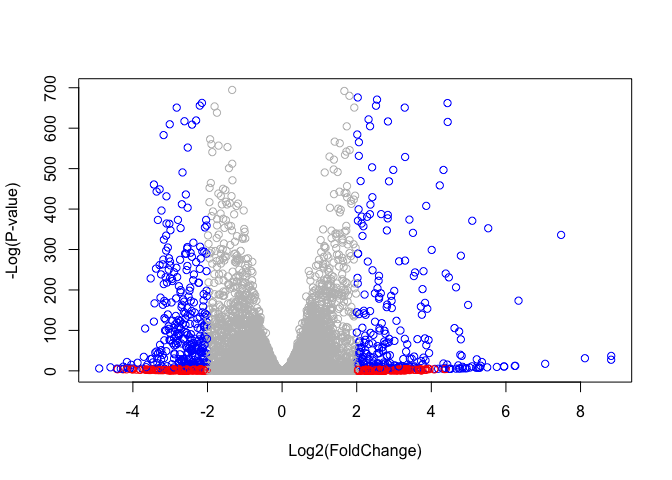

Class15
================

``` r
library(DESeq2)
```

    ## Loading required package: S4Vectors

    ## Loading required package: stats4

    ## Loading required package: BiocGenerics

    ## Loading required package: parallel

    ## 
    ## Attaching package: 'BiocGenerics'

    ## The following objects are masked from 'package:parallel':
    ## 
    ##     clusterApply, clusterApplyLB, clusterCall, clusterEvalQ,
    ##     clusterExport, clusterMap, parApply, parCapply, parLapply,
    ##     parLapplyLB, parRapply, parSapply, parSapplyLB

    ## The following objects are masked from 'package:stats':
    ## 
    ##     IQR, mad, sd, var, xtabs

    ## The following objects are masked from 'package:base':
    ## 
    ##     anyDuplicated, append, as.data.frame, basename, cbind,
    ##     colnames, dirname, do.call, duplicated, eval, evalq, Filter,
    ##     Find, get, grep, grepl, intersect, is.unsorted, lapply, Map,
    ##     mapply, match, mget, order, paste, pmax, pmax.int, pmin,
    ##     pmin.int, Position, rank, rbind, Reduce, rownames, sapply,
    ##     setdiff, sort, table, tapply, union, unique, unsplit, which,
    ##     which.max, which.min

    ## 
    ## Attaching package: 'S4Vectors'

    ## The following object is masked from 'package:base':
    ## 
    ##     expand.grid

    ## Loading required package: IRanges

    ## Loading required package: GenomicRanges

    ## Loading required package: GenomeInfoDb

    ## Loading required package: SummarizedExperiment

    ## Loading required package: Biobase

    ## Welcome to Bioconductor
    ## 
    ##     Vignettes contain introductory material; view with
    ##     'browseVignettes()'. To cite Bioconductor, see
    ##     'citation("Biobase")', and for packages 'citation("pkgname")'.

    ## Loading required package: DelayedArray

    ## Loading required package: matrixStats

    ## 
    ## Attaching package: 'matrixStats'

    ## The following objects are masked from 'package:Biobase':
    ## 
    ##     anyMissing, rowMedians

    ## Loading required package: BiocParallel

    ## 
    ## Attaching package: 'DelayedArray'

    ## The following objects are masked from 'package:matrixStats':
    ## 
    ##     colMaxs, colMins, colRanges, rowMaxs, rowMins, rowRanges

    ## The following objects are masked from 'package:base':
    ## 
    ##     aperm, apply, rowsum

    ## Registered S3 methods overwritten by 'ggplot2':
    ##   method         from 
    ##   [.quosures     rlang
    ##   c.quosures     rlang
    ##   print.quosures rlang

``` r
metaFile <- "GSE37704_metadata.csv"
countFile <- "GSE37704_featurecounts.csv"
```

``` r
colData = read.csv(metaFile, row.names=1)
head(colData)
```

    ##               condition
    ## SRR493366 control_sirna
    ## SRR493367 control_sirna
    ## SRR493368 control_sirna
    ## SRR493369      hoxa1_kd
    ## SRR493370      hoxa1_kd
    ## SRR493371      hoxa1_kd

``` r
countData = read.csv(countFile, row.names=1)
head(countData)
```

    ##                 length SRR493366 SRR493367 SRR493368 SRR493369 SRR493370
    ## ENSG00000186092    918         0         0         0         0         0
    ## ENSG00000279928    718         0         0         0         0         0
    ## ENSG00000279457   1982        23        28        29        29        28
    ## ENSG00000278566    939         0         0         0         0         0
    ## ENSG00000273547    939         0         0         0         0         0
    ## ENSG00000187634   3214       124       123       205       207       212
    ##                 SRR493371
    ## ENSG00000186092         0
    ## ENSG00000279928         0
    ## ENSG00000279457        46
    ## ENSG00000278566         0
    ## ENSG00000273547         0
    ## ENSG00000187634       258

``` r
countData2 <- as.matrix(countData[,2:ncol(countData)])
head(countData2)
```

    ##                 SRR493366 SRR493367 SRR493368 SRR493369 SRR493370
    ## ENSG00000186092         0         0         0         0         0
    ## ENSG00000279928         0         0         0         0         0
    ## ENSG00000279457        23        28        29        29        28
    ## ENSG00000278566         0         0         0         0         0
    ## ENSG00000273547         0         0         0         0         0
    ## ENSG00000187634       124       123       205       207       212
    ##                 SRR493371
    ## ENSG00000186092         0
    ## ENSG00000279928         0
    ## ENSG00000279457        46
    ## ENSG00000278566         0
    ## ENSG00000273547         0
    ## ENSG00000187634       258

``` r
countData2 = countData2[(rowSums(countData2)>0), ]
head(countData2)
```

    ##                 SRR493366 SRR493367 SRR493368 SRR493369 SRR493370
    ## ENSG00000279457        23        28        29        29        28
    ## ENSG00000187634       124       123       205       207       212
    ## ENSG00000188976      1637      1831      2383      1226      1326
    ## ENSG00000187961       120       153       180       236       255
    ## ENSG00000187583        24        48        65        44        48
    ## ENSG00000187642         4         9        16        14        16
    ##                 SRR493371
    ## ENSG00000279457        46
    ## ENSG00000187634       258
    ## ENSG00000188976      1504
    ## ENSG00000187961       357
    ## ENSG00000187583        64
    ## ENSG00000187642        16

``` r
dds = DESeqDataSetFromMatrix(countData=countData2,
                             colData=colData,
                             design=~condition)
dds = DESeq(dds)
```

    ## estimating size factors

    ## estimating dispersions

    ## gene-wise dispersion estimates

    ## mean-dispersion relationship

    ## final dispersion estimates

    ## fitting model and testing

``` r
dds
```

    ## class: DESeqDataSet 
    ## dim: 15975 6 
    ## metadata(1): version
    ## assays(4): counts mu H cooks
    ## rownames(15975): ENSG00000279457 ENSG00000187634 ...
    ##   ENSG00000276345 ENSG00000271254
    ## rowData names(22): baseMean baseVar ... deviance maxCooks
    ## colnames(6): SRR493366 SRR493367 ... SRR493370 SRR493371
    ## colData names(2): condition sizeFactor

``` r
res = results(dds)
```

``` r
summary(res)
```

    ## 
    ## out of 15975 with nonzero total read count
    ## adjusted p-value < 0.1
    ## LFC > 0 (up)       : 4349, 27%
    ## LFC < 0 (down)     : 4396, 28%
    ## outliers [1]       : 0, 0%
    ## low counts [2]     : 1237, 7.7%
    ## (mean count < 0)
    ## [1] see 'cooksCutoff' argument of ?results
    ## [2] see 'independentFiltering' argument of ?results

``` r
# plot( res$log2FoldChange, -log(res$padj) )
# Make a color vector for all genes
mycols <- rep("gray", nrow(res) )

# Color red the genes with absolute fold change above 2
mycols[ abs(res$log2FoldChange) > 2 ] <- "red"

# Color blue those with adjusted p-value less than 0.01
#  and absolute fold change more than 2
inds <- ((res$padj<0.01) & (abs(res$log2FoldChange) > 2 ))
mycols[ inds ] <- "blue"

plot( res$log2FoldChange, -log(res$padj), col = mycols, xlab= "Log2(FoldChange)", ylab="-Log(P-value)" )
```

<!-- -->

``` r
library("AnnotationDbi")
library("org.Hs.eg.db")
```

    ## 

``` r
columns(org.Hs.eg.db)
```

    ##  [1] "ACCNUM"       "ALIAS"        "ENSEMBL"      "ENSEMBLPROT" 
    ##  [5] "ENSEMBLTRANS" "ENTREZID"     "ENZYME"       "EVIDENCE"    
    ##  [9] "EVIDENCEALL"  "GENENAME"     "GO"           "GOALL"       
    ## [13] "IPI"          "MAP"          "OMIM"         "ONTOLOGY"    
    ## [17] "ONTOLOGYALL"  "PATH"         "PFAM"         "PMID"        
    ## [21] "PROSITE"      "REFSEQ"       "SYMBOL"       "UCSCKG"      
    ## [25] "UNIGENE"      "UNIPROT"

``` r
res$symbol = mapIds(org.Hs.eg.db,
                    keys = row.names(res), 
                    keytype = "ENSEMBL",
                    column = "SYMBOL",
                    multiVals = "first")
```

    ## 'select()' returned 1:many mapping between keys and columns

``` r
res$entrez = mapIds(org.Hs.eg.db,
                    keys = row.names(res),
                    keytype="ENSEMBL",
                    column="ENTREZID",
                    multiVals="first")
```

    ## 'select()' returned 1:many mapping between keys and columns

``` r
res$name =   mapIds(org.Hs.eg.db,
                    keys = row.names(res),
                    keytype = "ENSEMBL",
                    column = "GENENAME",
                    multiVals = "first")
```

    ## 'select()' returned 1:many mapping between keys and columns

``` r
head(res, 10)
```

    ## log2 fold change (MLE): condition hoxa1 kd vs control sirna 
    ## Wald test p-value: condition hoxa1 kd vs control sirna 
    ## DataFrame with 10 rows and 9 columns
    ##                          baseMean     log2FoldChange              lfcSE
    ##                         <numeric>          <numeric>          <numeric>
    ## ENSG00000279457  29.9135794276176   0.17925708367269  0.324821565250143
    ## ENSG00000187634  183.229649921658  0.426457118403306  0.140265820376894
    ## ENSG00000188976  1651.18807619944 -0.692720464846371 0.0548465415913881
    ## ENSG00000187961  209.637938486147  0.729755610585224  0.131859899969347
    ## ENSG00000187583  47.2551232589398 0.0405765278756296  0.271892808601772
    ## ENSG00000187642  11.9797501642461  0.542810491577362  0.521559849534146
    ## ENSG00000188290  108.922127976716    2.0570638345631  0.196905312993837
    ## ENSG00000187608   350.71686801731  0.257383686481775  0.102726560033547
    ## ENSG00000188157    9128.439421961   0.38990879202277 0.0467163395511419
    ## ENSG00000237330 0.158192358990472  0.785955208142751    4.0804728567969
    ##                              stat               pvalue
    ##                         <numeric>            <numeric>
    ## ENSG00000279457 0.551863246932651     0.58104205074703
    ## ENSG00000187634  3.04034951107416  0.00236303749731038
    ## ENSG00000188976 -12.6301576133497  1.4398954015367e-36
    ## ENSG00000187961  5.53432552849551  3.1242824807789e-08
    ## ENSG00000187583 0.149237223611383    0.881366448669151
    ## ENSG00000187642  1.04074439790984    0.297994191720984
    ## ENSG00000188290  10.4469696794189 1.51281875407473e-25
    ## ENSG00000187608  2.50552229528295   0.0122270689409891
    ## ENSG00000188157  8.34630443585853 7.04321148763261e-17
    ## ENSG00000237330 0.192613757210411    0.847261469988086
    ##                                 padj      symbol      entrez
    ##                            <numeric> <character> <character>
    ## ENSG00000279457    0.686554777832897          NA          NA
    ## ENSG00000187634  0.00515718149494453      SAMD11      148398
    ## ENSG00000188976 1.76548905389749e-35       NOC2L       26155
    ## ENSG00000187961 1.13412993107683e-07      KLHL17      339451
    ## ENSG00000187583    0.919030615571384     PLEKHN1       84069
    ## ENSG00000187642    0.403379309754108       PERM1       84808
    ## ENSG00000188290 1.30538189681226e-24        HES4       57801
    ## ENSG00000187608   0.0237452288908021       ISG15        9636
    ## ENSG00000188157 4.21962808555811e-16        AGRN      375790
    ## ENSG00000237330                   NA      RNF223      401934
    ##                                                                     name
    ##                                                              <character>
    ## ENSG00000279457                                                       NA
    ## ENSG00000187634                 sterile alpha motif domain containing 11
    ## ENSG00000188976 NOC2 like nucleolar associated transcriptional repressor
    ## ENSG00000187961                              kelch like family member 17
    ## ENSG00000187583                 pleckstrin homology domain containing N1
    ## ENSG00000187642             PPARGC1 and ESRR induced regulator, muscle 1
    ## ENSG00000188290                   hes family bHLH transcription factor 4
    ## ENSG00000187608                            ISG15 ubiquitin like modifier
    ## ENSG00000188157                                                    agrin
    ## ENSG00000237330                                  ring finger protein 223
