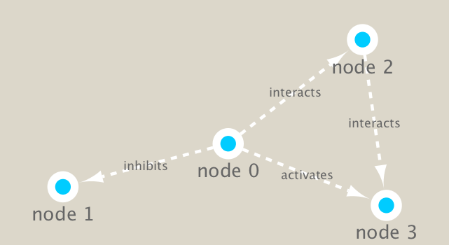

```{r setup, include=FALSE}
knitr::opts_chunk$set(echo = TRUE)
```

```{r}
# BiocManager::install("RCy3")
# igraph install
```

```{r}
library(RCy3)
library(igraph)
library(RColorBrewer)
```

```{r}
cytoscapePing()
```

```{r}
cytoscapeVersionInfo()
```

```{r}
g <- makeSimpleIgraph()
createNetworkFromIgraph(g,"myGraph")
```

```{r}
setVisualStyle("Marquee")
fig <- exportImage(filename="demo", type="png", height=350)

```

```{r}
prok_vir_cor <- read.delim("virus_prok_cor_abundant.tsv", stringsAsFactors = FALSE)
```

```{r}
g <- graph.data.frame(prok_vir_cor, directed = FALSE)
class(g)
# How many edges will we have?
nrow(prok_vir_cor)
# How many unique species are there?
length(unique(c(prok_vir_cor[,1], prok_vir_cor[,2])))
```

```{r}
plot(g, vertex.size = 3, vertex.label = NA)
```

```{r}
cb <- cluster_edge_betweenness(g)
plot(cb, y=g, vertex.label = NA, vertex.size = 3)
```

```{r}
head( membership(cb) )
```

```{r}
# Calculate and plot node degree of our network
d <- degree(g)
hist(d, breaks=30, col="lightblue", main ="Node Degree Distribution")
```

```{r}
plot( degree_distribution(g), type="h" )
```

```{r}
pr <- page_rank(g)
head(pr$vector)
```

```{r}
v.size <- BBmisc::normalize(pr$vector, range=c(2,20), method="range")
plot(g, vertex.size=v.size, vertex.label=NA)
```

```{r}
v.size <- BBmisc::normalize(d, range=c(2,20), method="range")
plot(g, vertex.size=v.size, vertex.label=NA)
```

```{r}
b <- betweenness(g)
v.size <- BBmisc::normalize(b, range=c(2,20), method="range")
plot(g, vertex.size=v.size, vertex.label=NA)
```

```{r}
phage_id_affiliation <- read.delim("phage_ids_with_affiliation.tsv")
head(phage_id_affiliation)
```

```{r}
bac_id_affi <- read.delim("prok_tax_from_silva.tsv", stringsAsFactors = FALSE)
head(bac_id_affi)
```

```{r}
## Extract out our vertex names
genenet.nodes <- as.data.frame(vertex.attributes(g), stringsAsFactors=FALSE)
head(genenet.nodes)
```

```{r}
length( grep("^ph_",genenet.nodes[,1]) )
```

```{r}
# We dont need all annotation data so lets make a reduced table 'z' for merging
z <- bac_id_affi[,c("Accession_ID", "Kingdom", "Phylum", "Class")]
n <- merge(genenet.nodes, z, by.x="name", by.y="Accession_ID", all.x=TRUE)
head(n)
```

```{r}
colnames(n)
```

