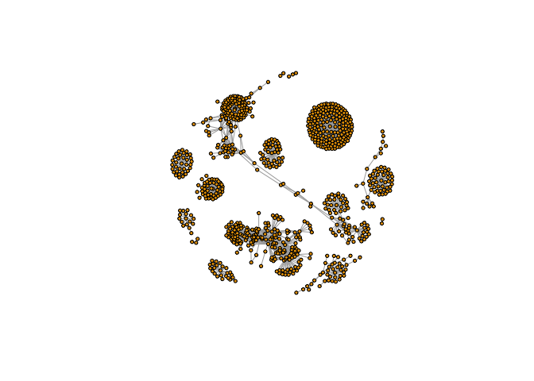
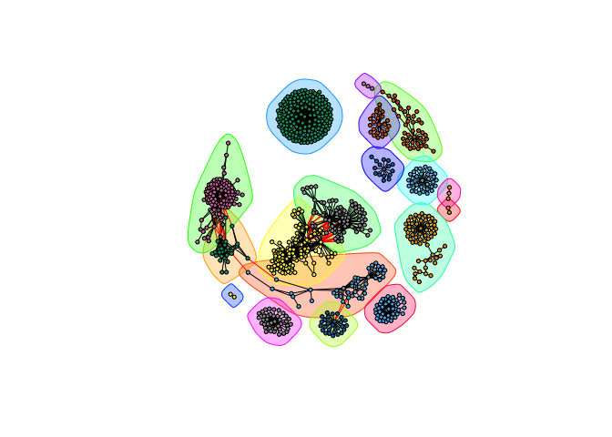
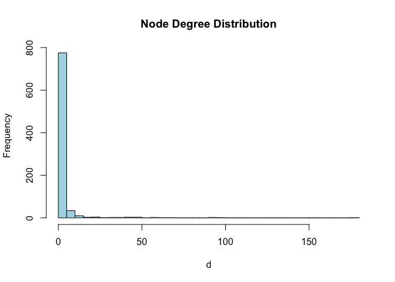
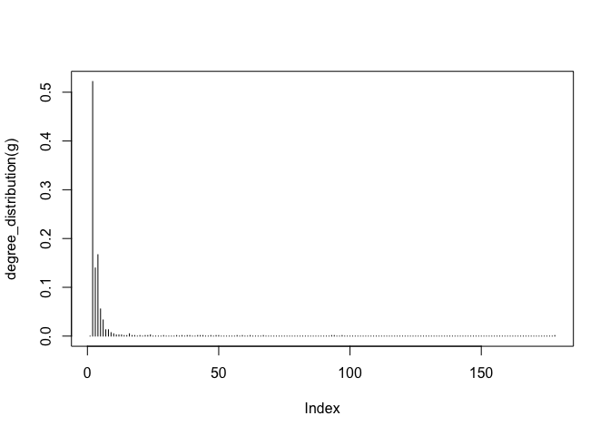
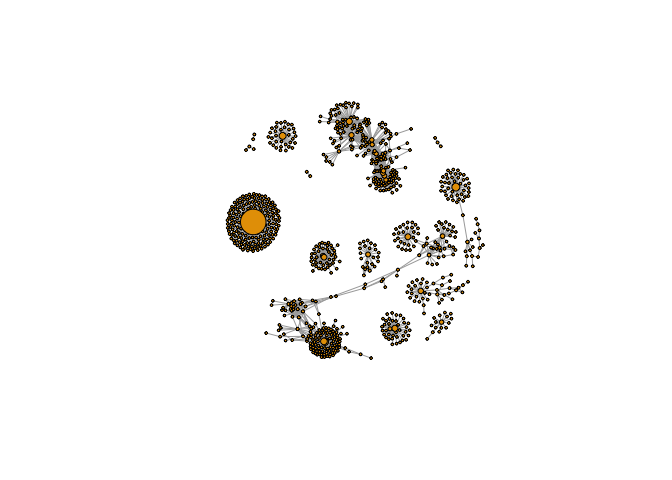
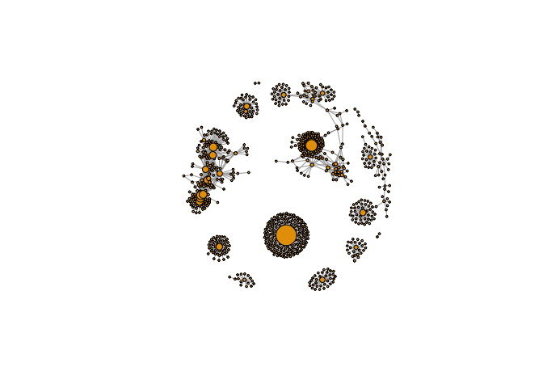
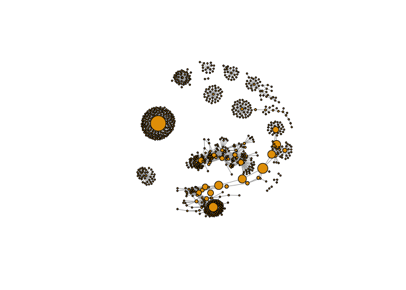

Class17
================

``` r
# BiocManager::install("RCy3")
# igraph install
```

``` r
library(RCy3)
```

    ## Registered S3 method overwritten by 'R.oo':
    ##   method        from       
    ##   throw.default R.methodsS3

``` r
library(igraph)
```

    ## 
    ## Attaching package: 'igraph'

    ## The following objects are masked from 'package:stats':
    ## 
    ##     decompose, spectrum

    ## The following object is masked from 'package:base':
    ## 
    ##     union

``` r
library(RColorBrewer)
```

``` r
# cytoscapePing()
```

``` r
# cytoscapeVersionInfo()
```

``` r
g <- makeSimpleIgraph()
createNetworkFromIgraph(g,"myGraph")
```

    ## Loading data...
    ## Applying default style...
    ## Applying preferred layout...

    ## networkSUID 
    ##          80

``` r
setVisualStyle("Marquee")
```

    ##                 message 
    ## "Visual Style applied."

``` r
fig <- exportImage(filename="demo", type="png", height=350)
```

    ## Warning: This file already exists. A Cytoscape popup 
    ##                 will be generated to confirm overwrite.

``` r
knitr::include_graphics("./demo.png")
```

<!-- -->

``` r
prok_vir_cor <- read.delim("virus_prok_cor_abundant.tsv", stringsAsFactors = FALSE)
```

``` r
g <- graph.data.frame(prok_vir_cor, directed = FALSE)
class(g)
```

    ## [1] "igraph"

``` r
# How many edges will we have?
nrow(prok_vir_cor)
```

    ## [1] 1544

``` r
# How many unique species are there?
length(unique(c(prok_vir_cor[,1], prok_vir_cor[,2])))
```

    ## [1] 845

``` r
plot(g, vertex.size = 3, vertex.label = NA)
```

<!-- -->

``` r
cb <- cluster_edge_betweenness(g)
```

    ## Warning in cluster_edge_betweenness(g): At community.c:460 :Membership
    ## vector will be selected based on the lowest modularity score.

    ## Warning in cluster_edge_betweenness(g): At community.c:467 :Modularity
    ## calculation with weighted edge betweenness community detection might not
    ## make sense -- modularity treats edge weights as similarities while edge
    ## betwenness treats them as distances

``` r
plot(cb, y=g, vertex.label = NA, vertex.size = 3)
```

<!-- -->

``` r
head( membership(cb) )
```

    ##  ph_1061  ph_1258  ph_3164  ph_1033 ph_10996 ph_11038 
    ##        1        2        3        4        4        4

``` r
# Calculate and plot node degree of our network
d <- degree(g)
hist(d, breaks=30, col="lightblue", main ="Node Degree Distribution")
```

<!-- -->

``` r
plot( degree_distribution(g), type="h" )
```

<!-- -->

``` r
pr <- page_rank(g)
head(pr$vector)
```

    ##      ph_1061      ph_1258      ph_3164      ph_1033     ph_10996 
    ## 0.0011834320 0.0011599483 0.0019042088 0.0005788564 0.0005769663 
    ##     ph_11038 
    ## 0.0005745460

``` r
v.size <- BBmisc::normalize(pr$vector, range=c(2,20), method="range")
plot(g, vertex.size=v.size, vertex.label=NA)
```

<!-- -->

``` r
v.size <- BBmisc::normalize(d, range=c(2,20), method="range")
plot(g, vertex.size=v.size, vertex.label=NA)
```

<!-- -->

``` r
b <- betweenness(g)
v.size <- BBmisc::normalize(b, range=c(2,20), method="range")
plot(g, vertex.size=v.size, vertex.label=NA)
```

<!-- -->

``` r
phage_id_affiliation <- read.delim("phage_ids_with_affiliation.tsv")
head(phage_id_affiliation)
```

    ##   first_sheet.Phage_id first_sheet.Phage_id_network phage_affiliation
    ## 1        109DCM_115804                       ph_775              <NA>
    ## 2        109DCM_115804                       ph_775              <NA>
    ## 3        109DCM_115804                       ph_775              <NA>
    ## 4        109DCM_115804                       ph_775              <NA>
    ## 5        109DCM_115804                       ph_775              <NA>
    ## 6        109DCM_115804                       ph_775              <NA>
    ##   Domain DNA_or_RNA Tax_order Tax_subfamily Tax_family Tax_genus
    ## 1   <NA>       <NA>      <NA>          <NA>       <NA>      <NA>
    ## 2   <NA>       <NA>      <NA>          <NA>       <NA>      <NA>
    ## 3   <NA>       <NA>      <NA>          <NA>       <NA>      <NA>
    ## 4   <NA>       <NA>      <NA>          <NA>       <NA>      <NA>
    ## 5   <NA>       <NA>      <NA>          <NA>       <NA>      <NA>
    ## 6   <NA>       <NA>      <NA>          <NA>       <NA>      <NA>
    ##   Tax_species
    ## 1        <NA>
    ## 2        <NA>
    ## 3        <NA>
    ## 4        <NA>
    ## 5        <NA>
    ## 6        <NA>

``` r
bac_id_affi <- read.delim("prok_tax_from_silva.tsv", stringsAsFactors = FALSE)
head(bac_id_affi)
```

    ##    Accession_ID  Kingdom         Phylum          Class             Order
    ## 1 AACY020068177 Bacteria    Chloroflexi   SAR202 clade marine metagenome
    ## 2 AACY020125842  Archaea  Euryarchaeota Thermoplasmata Thermoplasmatales
    ## 3 AACY020187844  Archaea  Euryarchaeota Thermoplasmata Thermoplasmatales
    ## 4 AACY020105546 Bacteria Actinobacteria Actinobacteria             PeM15
    ## 5 AACY020281370  Archaea  Euryarchaeota Thermoplasmata Thermoplasmatales
    ## 6 AACY020147130  Archaea  Euryarchaeota Thermoplasmata Thermoplasmatales
    ##              Family             Genus Species
    ## 1              <NA>              <NA>    <NA>
    ## 2   Marine Group II marine metagenome    <NA>
    ## 3   Marine Group II marine metagenome    <NA>
    ## 4 marine metagenome              <NA>    <NA>
    ## 5   Marine Group II marine metagenome    <NA>
    ## 6   Marine Group II marine metagenome    <NA>

``` r
## Extract out our vertex names
genenet.nodes <- as.data.frame(vertex.attributes(g), stringsAsFactors=FALSE)
head(genenet.nodes)
```

    ##       name
    ## 1  ph_1061
    ## 2  ph_1258
    ## 3  ph_3164
    ## 4  ph_1033
    ## 5 ph_10996
    ## 6 ph_11038

``` r
length( grep("^ph_",genenet.nodes[,1]) )
```

    ## [1] 764

``` r
# We dont need all annotation data so lets make a reduced table 'z' for merging
z <- bac_id_affi[,c("Accession_ID", "Kingdom", "Phylum", "Class")]
n <- merge(genenet.nodes, z, by.x="name", by.y="Accession_ID", all.x=TRUE)
head(n)
```

    ##            name  Kingdom          Phylum               Class
    ## 1 AACY020068177 Bacteria     Chloroflexi        SAR202 clade
    ## 2 AACY020207233 Bacteria Deferribacteres     Deferribacteres
    ## 3 AACY020255495 Bacteria  Proteobacteria Gammaproteobacteria
    ## 4 AACY020288370 Bacteria  Actinobacteria      Acidimicrobiia
    ## 5 AACY020396101 Bacteria  Actinobacteria      Acidimicrobiia
    ## 6 AACY020398456 Bacteria  Proteobacteria Gammaproteobacteria

``` r
colnames(n)
```

    ## [1] "name"    "Kingdom" "Phylum"  "Class"
